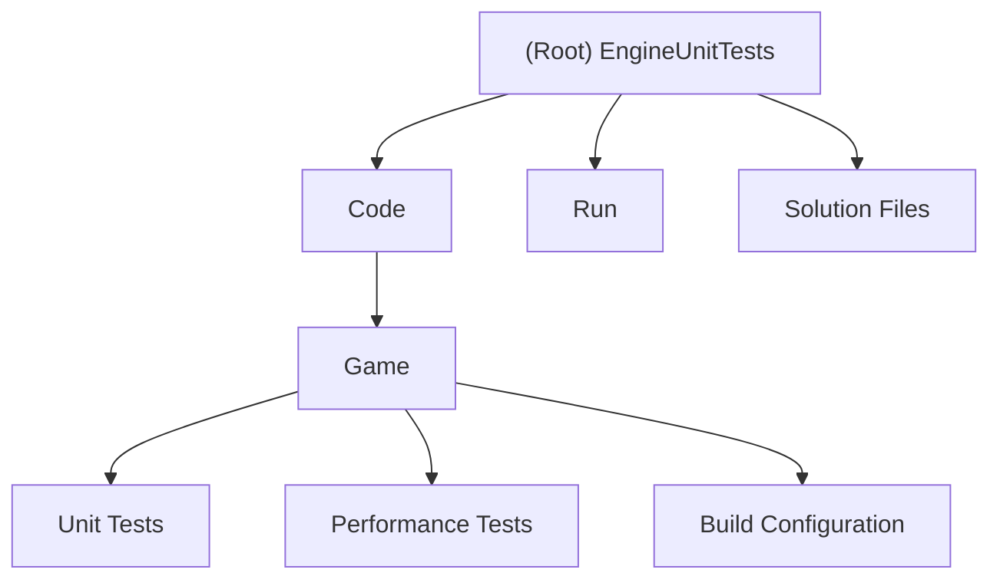

# EngineUnitTests Project

## Changelog

### 2025-09-23 23:46:27
- Initial AI context initialization
- Created comprehensive documentation structure
- Added module navigation and project overview

---

## Project Vision

EngineUnitTests is a comprehensive C++ unit testing framework designed for game engine development. The project focuses on testing mathematical operations, performance benchmarks, and game engine components for SMU Guildhall coursework assignments (MP1-A1 through MP2-A2).

## Architecture Overview

This project serves as a standalone unit testing suite that validates the correctness and performance of a separate game engine codebase. It follows a modular testing approach with organized test sets for different engine components.

### Key Components:
- **Unit Test Framework**: Custom test runner with grading capabilities
- **Math Library Tests**: Comprehensive testing for Vec2, AABB2, and other math components
- **Performance Benchmarks**: High-precision performance measurements for critical operations
- **Engine Integration**: Links with external Engine project for component testing

## Module Structure Diagram



## Module Index

| Module | Path | Description | Status |
|--------|------|-------------|--------|
| **Game** | [Code/Game](./Code/Game/CLAUDE.md) | Main testing module with unit tests and performance benchmarks | Active |

## Running and Development

### Prerequisites
- Visual Studio 2022 (v143 toolset)
- C++17 support
- Windows 10 SDK
- Access to separate Engine project (external dependency)

### Building the Project
1. Open `EngineUnitTests.sln` in Visual Studio
2. Ensure Engine project is available at `../Engine/Code/Engine/Engine.vcxproj`
3. Build solution (Debug/Release x64 or x86)
4. Executable will be copied to `Run/` directory

### Running Tests
```bash
# From Run directory
./EngineUnitTests_Debug_x64.exe
```

### Enabling/Disabling Test Sets
Tests can be controlled via `#define` directives in respective header files:
- Comment out `#define ENABLE_TestSet_*` to disable specific test sets
- All test sets should be enabled for assignment submissions

## Testing Strategy

### Unit Test Categories
1. **MP1 Series** - Math library fundamentals (Vec2, operators, construction)
2. **MP2 Series** - Advanced math components (AABB2, collision detection)
3. **Custom Tests** - User-defined additional test cases
4. **Performance Tests** - Benchmarking critical operations

### Test Framework Features
- **Graded vs Non-Graded Tests**: Separate tracking for assignment grading
- **Automatic Scoring**: Built-in grade calculation (100 - 2 points per failed test)
- **Detailed Reporting**: Individual test failure messages and summary statistics
- **Error Detection**: Validates test set integrity (expected vs actual test counts)

### Performance Benchmarking
- High-resolution timing (microsecond precision)
- Warmup iterations to reduce measurement noise
- Configurable iteration counts for thorough testing
- Separate performance test categories for different operation types

## Coding Standards

### Project Structure
- **Modular Design**: Each assignment/component has dedicated header/source pairs
- **Clean Separation**: Test code isolated from engine code
- **Consistent Naming**: Clear prefixes for test functions and classes

### Code Guidelines
- C++17 standard compliance
- Consistent indentation and formatting
- Comprehensive commenting for test purposes
- Use of `#pragma once` for header guards

### Test Writing Standards
- Each test set returns expected test count for validation
- Use `VerifyTestResult()` for test assertions
- Include descriptive test names for failure reporting
- Follow pattern: Setup → Execute → Verify → Cleanup

## AI Usage Guidelines

### When Working with This Codebase
- **Read-Only Analysis**: Examine test patterns and engine interfaces
- **Documentation Updates**: Maintain this documentation as tests evolve
- **Test Pattern Recognition**: Identify common testing approaches
- **Performance Analysis**: Help interpret benchmark results

### Restrictions
- **No Test Modification**: Tests are provided by instructor - do not modify
- **No Cheating**: Avoid generating solutions to graded assignments
- **Academic Integrity**: Maintain proper academic standards

### Recommended AI Assistance
- Code review and style consistency
- Documentation generation and maintenance
- Performance analysis and optimization suggestions
- Test coverage analysis and gap identification

---

**Last Updated**: 2025-09-23 23:46:27  
**Project Type**: C++ Unit Testing Framework  
**Build System**: Visual Studio MSBuild  
**Platform**: Windows (x64/x86)